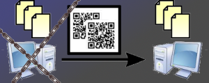

#  BLAKER

BLAKER (ブレイカー) は、紙、画像、または動画を用いてデータファイルを転送するための無料のWindowsアプリケーションです。

<p align="center></p>

これは冗談のプログラムではなく、現実的なビジネス上の問題の解決策です。

ダウンロード: https://katahiromz.web.fc2.com/blaker/ja

## BLAKER Papers の使い方

1. いくつかファイルをBLAKERに読み込む。
2. BLAKERで物理的な紙に印刷する。
3. とにかくそれらの紙をPDFファイルにする。
4. 別のパソコンでそのPDFファイルをBLAKERでスキャンする。
5. 元のファイルが復元される。

TWAINインターフェースは提供していません。 他のソフトウェアで紙をPDFファイルに変換してください。

## BLAKER Images の使い方

1. いくつかファイルをBLAKERに読み込む。
2. BLAKERで画像を上映し、その画像を撮影する。
3. 別のパソコンでそれらの画像ファイルをBLAKERでスキャンする。
4. 元のファイルが復元される。

## BLAKER Movie の使い方

1. いくつかファイルをBLAKERに読み込む。
2. BLAKERで動画を上映し、その動画を撮影する。
3. 別のパソコンでその動画ファイルをBLAKERでスキャンする。
4. 元のファイルが復元される。

## 1枚の用紙に印刷できるデータサイズは？

既定の60 DPIでは、A4サイズの用紙で約 20 KiB（圧縮後）です (これは冗談ではありません)。

あなたはより高いドット密度を選ぶことができますが、それは読み取り失敗を引き起こすかもしれません。

## 制限

- 印刷可能なページ数は99ページまで。
- 圧縮後の印刷可能なデータ量は256 KiBまで。
- 圧縮後の上映可能なデータ量は1.5 MiBまで。

紙を無駄にしないでください。 あなたはPDFプリンターの使用によってPDFファイルに仮想的に印刷できます。

## ビルド方法は?

`ZLIB`, `BZip2`, `LibLZMA`, `PNG`, `Iconv` and `OpenCV` ライブラリーが必要です。

MSYS2を使っているのであれば、それらを`pacman`でインストールして下さい。
さもなければ、それらを手動でインストールする必要があります。

```bash
$ git clone --recursive https://github.com/katahiromz/BLAKER.git
$ cd BLAKER
$ cmake -G "MSYS Makefiles" .
$ make -j2
```

## 連絡先

katayama.hirofumi.mz@gmail.com
